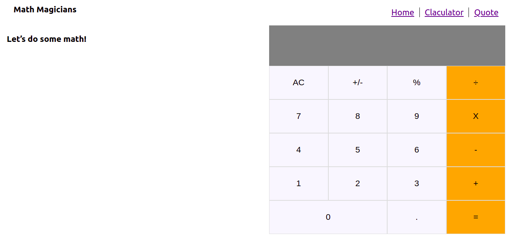
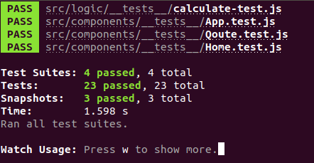

# React Calculator
 
 

This a Calculator project made it with react and integrated on Math Magicians page.

## Built With

- Npm
- React
- HTML5
- CSS3

## Live Demo

[Live Demo Link](https://reactcalculatorjosepedraza.herokuapp.com/)

## Getting Started

This is a calculator with basic math operation developed on React, Html and Css.

To get a local copy up and running follow these simple example steps.

### Prerequisites
- Npm

### Setup

### Install
Install all of the dependencies 

> npm install 

### Usage

Run the app on the browser:

> npm start

### Run tests
Once you already install the project and all of the dependencies

> npm test

Then click a to start all of the tests

## Authors

👤 **José Pedraza**

- Github: [@pastorp3](https://github.com/pastorp3)
- Twitter: [@jose_pastor](https://twitter.com/jose_pastorp3 )
- Linkedin: [linkedin](https://www.linkedin.com/in/jos%C3%A9-pedraza-acevedo-ab700a1a9/)

## 🤝 Contributing

Contributions, issues, and feature requests are welcome!

Feel free to check the [issues page](issues/).

## Show your support

Give a ⭐️ if you like this project!

## Acknowledgments

- Hat tip to anyone whose code was used
- Inspiration
- etc

## 📝 License

This project is [MIT](lic.url) licensed.

